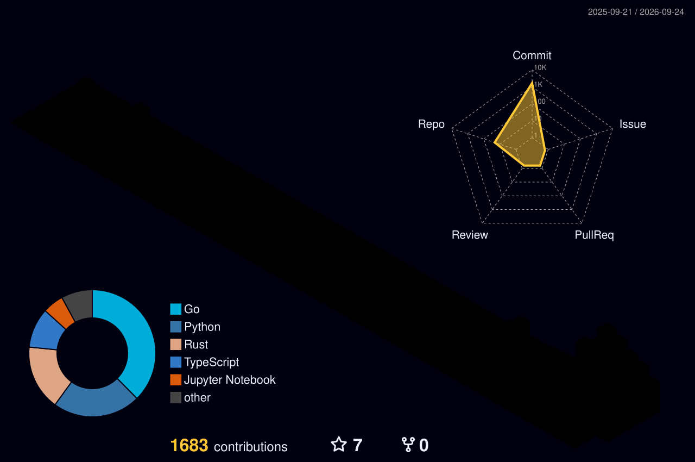

[](https://github.com/ajit-ai)

---

# 💫 About Me

> **Senior Solution Architect | Cloud & Polyglot Engineer**
>
> Architecting scalable, resilient, and high-performance distributed systems.
> Leveraging a strong polyglot engineering background and multi-cloud expertise
> to bridge the gap between complex business requirements and cutting-edge
> technical execution.

- 🔭 Currently researching **Quantum Computing** and **Quantum Machine Learning**
- 🌱 Deep-diving into **enterprise data architecture** & **AI-driven distributed systems**
- 🌌 Passionate about **cosmology** and connecting physics-inspired thinking to software design
- 💼 Entrepreneur & VC — advising teams on **multi-cloud strategy** and **platform engineering**
- 🗣️ Writing about engineering, architecture & science on [Medium](https://medium.com/@ajitjava2)
- 📫 Reach me at: **ajitjava2@gmail.com**

## 🌐 Socials

[](https://www.linkedin.com/in/ajit-kumar-4bb8b8183/)
[](https://medium.com/@ajitjava2)
[](mailto:ajitjava2@gmail.com)

---

# 💻 Tech Stack

### 🧵 Languages

[](https://skillicons.dev)
[](https://skillicons.dev)

### ☁️ Cloud, Platforms & DevOps

[](https://skillicons.dev)

### 🤖 AI, Data Science & Quantum

[](https://skillicons.dev)

---
---

# 📊 GitHub Stats

<br/>
<br/>


[](https://leetcode.com/ajitjava2)

<!-- ⏱️ WAKATIME — set up your free account at wakatime.com, install the editor plugin,
     then replace YOUR_WAKATIME_USERNAME below and remove these comment lines:
[]
-->

## 🏆 GitHub Achievements


## ⏰ When I Code (Productive Time)


---

# 🧠 Fun Facts — By The Numbers

```text
🗓️  11+ years on GitHub            (joined April 2015)
📦   37 public repositories
🌍   16+ programming languages explored
👥   23 followers · following 78
⭐    Community stars earned across projects
🚀   Active this week in Quantum Computing & Data Science
```

---

# 🔭 Current Focus

| Area | What I'm Exploring |
|------|--------------------|
| ⚛️ Quantum Computing | Quantum algorithms, Qiskit experiments & quantum ML |
| 📊 Data Science | Notebooks, statistical modeling & applied analytics |
| 🗣️ NLP | Natural language processing research & tooling |
| ☁️ Cloud Architecture | Multi-cloud patterns for resilient enterprise systems |

---

# 💼 My Journey

```text
   🌌  Cosmology & quantum curiosity — asking how the universe computes
        │
   🧑‍💻  Polyglot engineer — Java · Python · Go · Rust · Scala & beyond
        │
   ☁️   Senior Solution Architect — resilient multi-cloud distributed systems
        │
   📊   Enterprise & Data Architect — data platforms & analytics at scale
        │
   🚀   Entrepreneur · VC · Quantum researcher — building what comes next
```

---

# 🎓 Certifications & Education

| Credential | Issuer | Year |
|------------|--------|------|
| *Add your certifications, degrees & courses here* | *Issuer* | *Year* |

<!-- Add rows like: | AWS Certified Solutions Architect | Amazon Web Services | 2024 | -->

---

# 📚 Repository Showcase

### ⚛️ Quantum · Data Science · AI Research

| Repository | About | Language |
|------------|-------|----------|
| [⚛️ QuantumComputing](https://github.com/ajit-ai/QuantumComputing) | Starting the Age of Quantum Innovation | `Jupyter` |
| [📊 Data_Science](https://github.com/ajit-ai/Data_Science) | Data science notebooks, analysis & visualizations | `Jupyter` |
| [🧠 Machine-Learning](https://github.com/ajit-ai/Machine-Learning) | Core ML algorithms & applied experiments | `Python` |
| [🕸️ Deep-Learning](https://github.com/ajit-ai/Deep-Learning) | Deep learning architectures & training notebooks | `Python` |
| [🔗 Neural-Network](https://github.com/ajit-ai/Neural-Network) | Neural network implementations from scratch | `Python` |
| [✨ Generative-AI](https://github.com/ajit-ai/Generative-AI) | Generative AI explorations & prompt engineering | `Python` |
| [🗣️ NLP](https://github.com/ajit-ai/NLP) | Natural language processing research & tooling | `Jupyter` |
| [👁️ Computer-Vision](https://github.com/ajit-ai/Computer-Vision) | Image processing & vision experiments | `Python` |
| [🤖 Robotics](https://github.com/ajit-ai/Robotics) | Robotics & intelligent automation projects | `Python` |
| [🔥 pytorch](https://github.com/ajit-ai/pytorch) | PyTorch model building & experimentation | `Python` |
| [🧪 Tensorflow-demo](https://github.com/ajit-ai/Tensorflow-demo) | TensorFlow demos & experiments | `Python` |
| [🐍 Python](https://github.com/ajit-ai/Python) | Python projects & computational notebooks | `Jupyter` |

### 🌐 Web · Applications · Systems

| Repository | About | Language |
|------------|-------|----------|
| [🌌 quantsmind-web](https://github.com/ajit-ai/quantsmind-web) | Quantum mind exploration — modern web app | `TypeScript` |
| [🌌 quantsmind-website](https://github.com/ajit-ai/quantsmind-website) | Quantums Mind exploration | `TypeScript` |
| [💰 quantsmoney-website](https://github.com/ajit-ai/quantsmoney-website) | Quantsmoney platform website | `HTML` |
| [🏙️ angularhosting](https://github.com/ajit-ai/angularhosting) | A visual journey through Jodhpur city | `HTML` |
| [🛠️ driversfiles](https://github.com/ajit-ai/driversfiles) | System driver files inspection & management tool | `Java` |
| [⚙️ fct](https://github.com/ajit-ai/fct) | Java-based utility application | `Java` |
| [⚡ Redis-Cache](https://github.com/ajit-ai/Redis-Cache) | Redis caching patterns & performance demos | — |

### 💻 Polyglot Language Labs

| Repository | Language |
|------------|----------|
| [☕ Java](https://github.com/ajit-ai/Java) | `Java` |
| [🗄️ SQL](https://github.com/ajit-ai/SQL) | `PLpgSQL` |
| [🐹 Golang](https://github.com/ajit-ai/Golang) | `Go` |
| [🦀 rust](https://github.com/ajit-ai/rust) | `Rust` |
| [⚙️ Cpp](https://github.com/ajit-ai/Cpp) | `C++` |
| [🔹 C](https://github.com/ajit-ai/C) | `C` |
| [🔴 Scala](https://github.com/ajit-ai/Scala) | `Scala` |
| [🎯 Kotlin](https://github.com/ajit-ai/Kotlin) | `Kotlin` |
| [🔬 Julia](https://github.com/ajit-ai/Julia) | `Julia` |
| [📈 R](https://github.com/ajit-ai/R) | `R` |
| [💎 Ruby](https://github.com/ajit-ai/Ruby) | `Ruby` |
| [🐍 Nim](https://github.com/ajit-ai/Nim) | `Nim` |
| [⚡ Zig](https://github.com/ajit-ai/Zig) | `Zig` |
| [🅅 Vlang](https://github.com/ajit-ai/Vlang) | `V` |
| [♯ CSharp](https://github.com/ajit-ai/CSharp) | `C#` |
| [🧩 Karkain-demo](https://github.com/ajit-ai/Karkain-demo) | `Karkain` |
| [🎸 Groovy](https://github.com/ajit-ai/Groovy) | `Groovy` |

---

# ✍️ Latest Articles on Medium

<!-- MEDIUM-POST-LIST:START -->
- [Quantum Algorithms — Way forward…](https://medium.com/@ajitjava2/quantum-algorithms-way-forward-5272751fe2ee?source=rss-802fd7bbd385------2)
<!-- MEDIUM-POST-LIST:END -->

---

# 🗿 3D Contribution Cityscape



---

# 🐍 Contribution Snake

<picture>
  <source media="(prefers-color-scheme: dark)" srcset="https://raw.githubusercontent.com/ajit-ai/ajit-ai/output/github-contribution-grid-snake-dark.svg" />
  <source media="(prefers-color-scheme: light)" srcset="https://raw.githubusercontent.com/ajit-ai/ajit-ai/output/github-contribution-grid-snake.svg" />
  
</picture>

---

# 💬 Dev Quote of the Moment

[](https://github.com/piyushsuthar/github-readme-quotes)

---

# ☕ Support My Work

[](https://github.com/sponsors/ajit-ai)
[](https://medium.com/@ajitjava2)

---


[](https://visitcount.itsvg.in)
